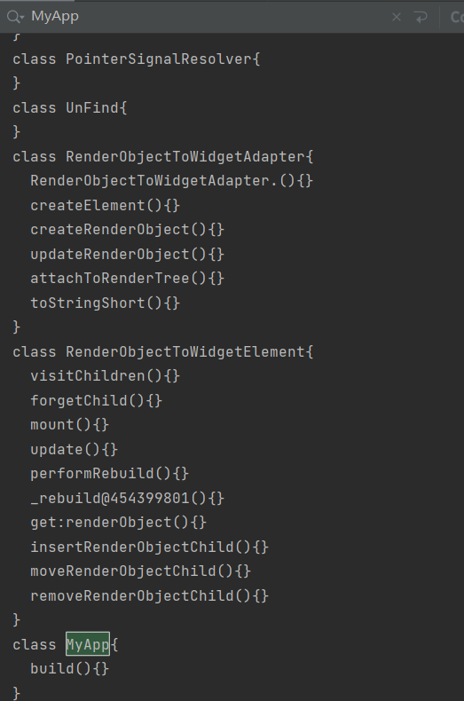

### unpackFlutter flutter快照解析器

### 工程说明

项目核心在于让大家了解flutter快照的解析流程

杂事诸多，自由更新，速度不快，耐心等待。

### 使用方式 

在分支里面选择对应的 flutter engine hash 版本的快照解析器

使用二进制文本编辑工具查看快照 version hash

- [flutter_3.0.4_engine_hash_6ba2af10bb05c88a2731482cedf2cfd11cf5af0b](https://github.com/MiDuoKi/unpackFlutter/tree/flutter_3.0.4_engine_hash_6ba2af10bb05c88a2731482cedf2cfd11cf5af0b)

libapp.so 放到 res 目录下即可

下面是解析效果展示

### 开发笔记和心得

看雪文章 我的主页分享

https://bbs.pediy.com/user-home-957606.htm 

更多相关的可以私聊或者 issue 

### TODO LIST

- 多版本兼容计划，鉴于多数应用还在使用flutter2，需要先适配flutter2版本的

### 感谢以下仓库提供参考

https://github.com/rscloura/Doldrums
